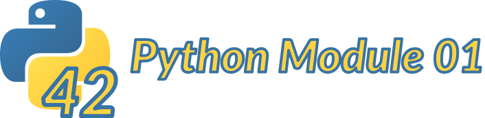

# Python Module 01

## Description
Python Module 01 is the second Python module at 42 school. Here you learn to work with classes, lists, and more OOP concepts.

***This project has been created as part of the 42 curriculum by Néo Foderé de Frutos (nfodere-), a student at 42 Barcelona***
